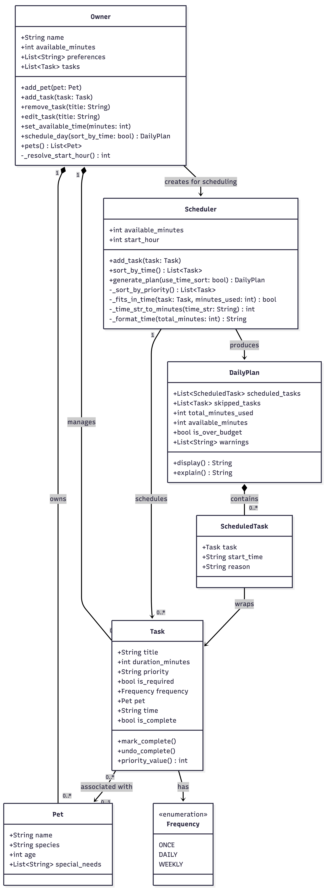

# PawPal+

A Streamlit app that helps busy pet owners plan and manage daily care tasks for their pets. PawPal+ generates smart daily schedules that respect time constraints, task priorities, and owner preferences — so your pets never miss a walk, meal, or medication.

---

## Features

### Owner & Pet Management
- Create an owner profile with a daily time budget and time-of-day preferences (morning, afternoon, evening)
- Register multiple pets with species, age, and special needs
- Edit and delete pet profiles at any time

### Task Management
- Add tasks with a title, duration, priority (high / medium / low), and frequency (once / daily / weekly)
- Assign tasks to a specific pet or apply them to all pets
- Pin tasks to a specific clock time (e.g. `08:00`) or let the scheduler place them freely
- Mark one-time tasks as complete — they will be excluded from future scheduling

### Smart Scheduling
- **Required tasks are always scheduled**, even when they exceed the owner's available time budget (with a warning)
- **Optional tasks fill remaining budget** — skipped if there is no time left
- **Conflict detection**: if multiple required tasks share the same pinned start time, a warning is shown
- **Optional tasks are bumped** when a required task occupies the same time slot
- Filter tasks by pet before generating a schedule
- Sort tasks by duration (shortest-first) for a tighter schedule

### Plan Display & Reasoning
- Shows each scheduled task with its start time, duration, and the reason it was included
- Lists skipped tasks with an explanation for why they were left out
- Displays time budget metrics (used vs. available) and any over-budget warnings

---

## Tech Stack

| Layer | Technology |
|-------|-----------|
| Language | Python 3.13+ |
| UI Framework | [Streamlit](https://streamlit.io/) >= 1.30 |
| Testing | [pytest](https://docs.pytest.org/) >= 7.0 |
| Architecture | OOP — dataclasses, enums, pure scheduling logic |

---

## Getting Started

### Prerequisites
- Python 3.10 or higher
- `pip`

### Installation

```bash
# 1. Clone the repository
git clone <repo-url>
cd ai110-module2show-pawpal-starter

# 2. Create and activate a virtual environment
python -m venv .venv
source .venv/bin/activate        # Windows: .venv\Scripts\activate

# 3. Install dependencies
pip install -r requirements.txt
```

### Run the App

```bash
streamlit run app.py
```

The app will open in your browser at `http://localhost:8501`.

### Run the Demo Script

```bash
python main.py
```

---

## Project Structure

```
ai110-module2show-pawpal-starter/
├── app.py               # Streamlit UI — owner setup, task management, schedule view
├── pawpal_system.py     # Core logic — data models, scheduler algorithm
├── main.py              # Demo script
├── tests/
│   └── test_pawpal.py   # pytest test suite (19 tests)
├── requirements.txt
├── uml_final.png        # UML class diagram
├── reflection.md        # Design reflections and tradeoffs
└── README.md
```

---

## Architecture Overview

All business logic lives in `pawpal_system.py`:

| Class | Responsibility |
|-------|---------------|
| `Frequency` | Enum for task recurrence: `ONCE`, `DAILY`, `WEEKLY` |
| `Task` | Task data + completion tracking + priority value |
| `Pet` | Pet profile (name, species, age, special needs) |
| `ScheduledTask` | Pairs a `Task` with its assigned start time and scheduling reason |
| `DailyPlan` | Schedule output: scheduled tasks, skipped tasks, time metrics, warnings |
| `Scheduler` | Core algorithm: conflict detection, budget reservation, interleaved placement |
| `Owner` | Orchestrator: manages pets/tasks, resolves time preferences, runs the scheduler |

### Scheduling Algorithm (high-level)

1. Filter out completed one-time tasks
2. Detect pinned-task conflicts; warn on overlapping required tasks; bump conflicting optional tasks
3. Partition tasks into **pinned** (anchored to a clock time) and **free** (flexible placement)
4. Sort free tasks by duration or priority depending on mode
5. Pre-reserve budget for all required tasks; optional tasks share whatever is left
6. Advance a time cursor through the day, interleaving free tasks into gaps between pinned tasks
7. Return a `DailyPlan` with the full schedule, skipped tasks, and any warnings

---

## Testing

Run the full test suite:

```bash
python -m pytest
```

For verbose output:

```bash
python -m pytest tests/test_pawpal.py -v
```

### Test Coverage (19 tests)

| Area | What is tested |
|------|---------------|
| Task completion | Mark complete / undo for `ONCE` vs. recurring tasks |
| Required tasks | Scheduled even when they exceed the time budget |
| Optional tasks | Skipped when budget is exhausted |
| Completed tasks | Excluded from scheduling |
| Incomplete one-time tasks | Included in scheduling |
| Conflict resolution | Optional tasks bumped by required tasks at the same time slot |
| Same-time required tasks | All scheduled with a conflict warning |
| Optional leftover | Scheduled when time remains after required tasks |
| Owner preferences | Morning / afternoon / evening map to correct start hours |
| Multiple preferences | First matching preference is applied |
| Unrecognized preferences | Defaults to `08:00` |
| Test count | Total test count validation |

---

## UML Diagram



---

## License

This project was built as part of the AI Engineering curriculum (Module 2). It is intended for educational use.
